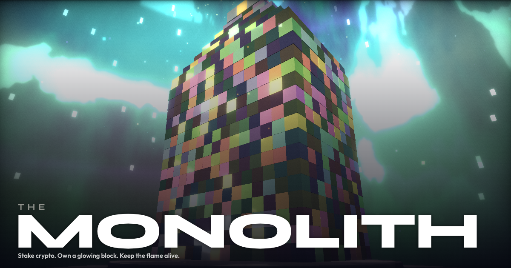

<p align="center">
  
</p>

<h1 align="center">The Monolith</h1>

<p align="center">
  <strong>r/Place meets DeFi -- in 3D.</strong><br/>
  Stake USDC. Claim a block. Keep it alive.
</p>

<p align="center">
  
  
  
  
  
</p>

<p align="center">
  
  
  
  
</p>

---

Every block on the tower is a real USDC stake on Solana. Every block has a face -- a **Spark** -- that reacts to how you take care of it. Charge it daily and it glows, evolves, climbs the leaderboard. Neglect it and someone else claims it.

The core loop takes **30 seconds a day**. That's the point.

---

## Try It

<p align="center">
  
</p>

<p align="center">
  <strong>Scan with your Android phone</strong><br/>
  or <a href="TESTING.md">follow the install guide</a>
</p>

---

## How It Works

```
SCAN  ->  See the tower, find your block
ACT   ->  Tap to charge, claim, or customize
FEEL  ->  Watch the glow burst, haptic feedback, rank change
DONE  ->  Close the app, come back tomorrow
```

## What's Built

| Feature | Details |
|---------|---------|
| **3D Tower** | 650+ blocks via InstancedMesh with custom GLSL shaders at 60 FPS on mobile |
| **On-Chain Staking** | USDC vault on Solana devnet -- Anchor program with deposit, withdraw, transfer |
| **Spark System** | Living faces that evolve through 5 tiers: Spark > Ember > Flame > Blaze > Beacon |
| **Charge Ritual** | Daily tap with streak multipliers, visual decay, energy feedback |
| **Customization** | 16 colors, 48 emoji, 11 animated GLSL styles, 7 textures |
| **Multiplayer** | Server-authoritative game logic via Colyseus, real-time sync across devices |
| **Social** | Poke other players, push notifications, Tapestry on-chain profiles |
| **Leaderboards** | Skyline, Brightest, Streaks, XP rankings via MagicBlock SOAR |
| **Onboarding** | 9-phase cinematic flow from first launch to first claim |
| **XP & Progression** | 10 levels, combo multipliers, 7 achievement types |
| **Content Engine** | Remotion pipeline for programmatic marketing videos |

## Tech Stack

<p align="center">
  
  
  
  
  
  
  
  
</p>

| Layer | Technology |
|-------|-----------|
| **Mobile** | Expo 54, React Native 0.81, React 19 |
| **3D Engine** | React Three Fiber v9, Three.js, custom GLSL shaders |
| **Wallet** | Mobile Wallet Adapter (MWA) + Seed Vault |
| **Smart Contract** | Anchor 0.31 (Rust) on Solana Devnet |
| **Game Server** | Colyseus on Node.js, deployed on Railway |
| **Database** | Supabase (Postgres) |
| **Social** | Tapestry Protocol (on-chain social graph) |
| **Leaderboard** | MagicBlock SOAR (on-chain scores + achievements) |
| **State** | Zustand (client), Colyseus schema (server) |

## Architecture

```
monolith/
├── apps/
│   ├── mobile/           # Expo React Native app (Android/Seeker)
│   ├── server/           # Colyseus game server
│   └── video/            # Remotion content engine
├── packages/
│   └── common/           # Shared types, constants, layout math
├── programs/
│   └── monolith/         # Anchor Solana program (Rust)
├── supabase/             # Database migrations
└── tests/                # Anchor integration tests
```

**Key decisions:**

- **USDC on-chain, game state off-chain** -- Ownership and staking verified on Solana. Fast game logic (charge, decay, streaks) runs on Colyseus for instant feedback.
- **InstancedMesh rendering** -- 650 blocks in 3 draw calls. Custom GLSL with ambient occlusion, subsurface scattering, GGX specular, SDF face rendering, and interior-mapped windows with parallax.
- **Server-authoritative** -- All game actions validated server-side with Supabase persistence.
- **Fire-and-forget blockchain** -- SOAR scores, Tapestry social, and Blinks pokes are non-blocking. The game never waits on a transaction.

## Solana Integrations

| Integration | What It Does |
|-------------|-------------|
| **Anchor Program** | USDC staking vault -- deposit, withdraw, transfer. Program: `Fu76Eq...gwDh` |
| **Mobile Wallet Adapter** | Native wallet connection via MWA + Seed Vault for Seeker |
| **Tapestry Protocol** | On-chain social profiles, follows, comments. Cross-app identity. |
| **MagicBlock SOAR** | On-chain leaderboard + 7 achievement types on claim, charge, poke |
| **Solana Blinks** | Shareable block action URLs rendered as dial.to cards |

## Game Mechanics

| Mechanic | Description |
|----------|-------------|
| **Charge Decay** | Blocks lose ~1 energy/hour. Tap daily to restore. |
| **Streaks** | Consecutive daily charges build multipliers up to 3x |
| **Dormant Reclaim** | Blocks at 0 energy for 3+ days become claimable by others |
| **Gravity Tax** | Owning adjacent blocks increases decay (anti-monopoly) |
| **Layer Pricing** | Higher floors cost more to claim (quadratic curve) |

## Testing

320+ tests across the stack:

```bash
cd apps/mobile && npx jest    # 222 unit tests (stores, shaders, math, multiplayer)
cd apps/server && npx jest    # 84 tests (room integration, XP, notifications, persistence)
anchor test                   # 14 on-chain tests (init, deposit, withdraw, multi-user)
```

## Quick Start

```bash
pnpm install                  # Install dependencies
pnpm server                   # Start game server
pnpm mobile                   # Start Expo dev server (separate terminal)
```

Or with a physical device:

```bash
./dev.sh                      # Sets up ADB, starts server + Expo
```

## Docs

| Document | Contents |
|----------|----------|
| [Architecture](docs/ARCHITECTURE.md) | System design, data flow, tech decisions |
| [Game Design](docs/game-design/GDD.md) | Full game design document |
| [Spark System](docs/game-design/SPARK_SYSTEM.md) | Spark evolution, faces, energy mechanics |
| [Anchor Program](docs/ANCHOR_PROGRAM.md) | Smart contract design and instructions |
| [Tester Guide](docs/TESTER_GUIDE.md) | How to install and play |
| [Setup Guide](docs/SETUP.md) | Developer environment setup |
| [Platform Vision](docs/vision/PLATFORM_VISION.md) | Long-term roadmap |

---

<p align="center">
  
  <br/>
  <sub>Built for the Solana Seeker. Proprietary -- all rights reserved.</sub>
</p>
