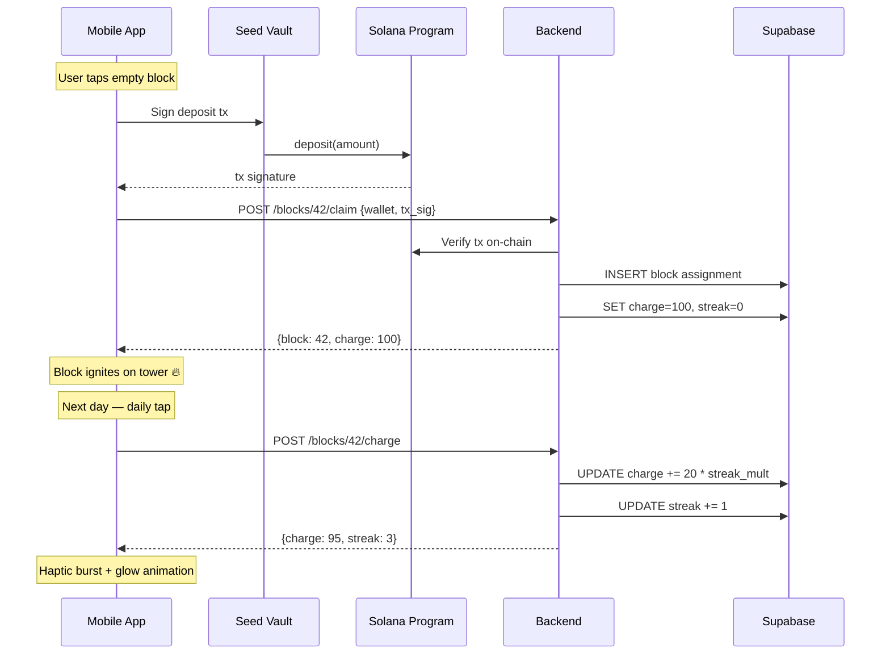

# From Vault to Game — Architecture Roadmap

> How the current USDC vault evolves into the full Monolith staking game.

---

## Where We Are (Current State)

```
┌─────────────────────────────────────────────┐
│            ON-CHAIN (Solana Program)        │
│                                              │
│  TowerState (1 PDA)                          │
│    ├─ authority, usdc_mint, vault            │
│    ├─ total_deposited (u64)                  │
│    └─ total_users (u32)                      │
│                                              │
│  UserDeposit (1 PDA per user)                │
│    ├─ owner, amount, last_deposit_at         │
│    └─ bump                                   │
│                                              │
│  Instructions: initialize, deposit, withdraw │
│                                              │
│  Vault ATA (holds all USDC)                  │
└─────────────────────────────────────────────┘
          ↕  MWA (Mobile Wallet Adapter)
┌─────────────────────────────────────────────┐
│           MOBILE APP (Expo/RN)              │
│                                              │
│  • Deposit/withdraw screens                  │
│  • Vault balance display                     │
│  • 3D tower scene (visual only, no blocks)   │
└─────────────────────────────────────────────┘
```

**What works:** USDC deposits/withdrawals confirmed on-chain, vault totals tracked.

**What's missing:** Blocks, Charge, streaks, visual feedback tied to on-chain state, backend game logic.

---

## Where We Need to Be (Game Vision)

```
User stakes USDC → Claims a specific block on the tower
  → Block glows based on Charge level
  → Charge decays over time
  → User taps daily to recharge
  → Streak builds → multiplier grows
  → Neighbors interact → districts form
  → Tower grows as TVL grows
```

---

## The Key Architectural Decision: On-Chain vs Off-Chain

### What stays ON-CHAIN (Solana program)
- **USDC custody** — the vault holds real money, must be trustless
- **Deposit / Withdraw** — the financial primitives
- **User deposit amounts** — provable on-chain balances

### What moves OFF-CHAIN (backend server / Supabase)
- **Block assignments** — which block ID belongs to which wallet
- **Charge levels** — decay ticks, daily taps, streak state
- **Customization** — colors, emoji, name tags
- **Leaderboards** — computed from block/charge state
- **Bot simulation** — seeded blocks with varied charge

> [!IMPORTANT]
> **Why off-chain for game state?** Charge decays every hour. Running a cron on-chain would be prohibitively expensive. The GDD explicitly says "Charge decay is server-side config." The on-chain program handles MONEY. The backend handles GAME LOGIC.

### The Trust Model

```
┌──────────────────────────────────────────────────────┐
│                  USER'S PERSPECTIVE                   │
│                                                       │
│  "My money is safe on-chain. I can withdraw anytime." │
│  "The game state (blocks, charge) is managed by the   │
│   server, but my USDC is always mine."                │
└──────────────────────────────────────────────────────┘
```

This is the same model as every web3 game: on-chain for assets, off-chain for game state. Users can always withdraw their USDC regardless of game state.

---

## Architecture: Three Layers

```
┌─────────────────────────────────────────────────────┐
│  LAYER 1: ON-CHAIN (Solana Program)                 │
│                                                      │
│  • USDC vault (deposit/withdraw)                     │
│  • UserDeposit PDAs (provable balances)              │
│  • TowerState PDA (TVL, user count)                  │
│                                                      │
│  NEW: claim_block(block_id, amount) instruction      │
│  → Associates a deposit with a specific block ID     │
│  → Emits event for backend to pick up                │
└──────────────────────┬──────────────────────────────┘
                       │ events / RPC polling
┌──────────────────────▼──────────────────────────────┐
│  LAYER 2: BACKEND (Supabase / Expo API Routes)      │
│                                                      │
│  Tables:                                             │
│  ├─ blocks (id, position, floor, owner_wallet,       │
│  │          charge, streak, color, emoji, name,      │
│  │          staked_amount, claimed_at)                │
│  ├─ charge_events (block_id, type, delta, ts)        │
│  └─ users (wallet, total_staked, blocks_owned)       │
│                                                      │
│  Logic:                                              │
│  ├─ Charge decay cron (1/hour prod, 1/min demo)      │
│  ├─ Daily tap endpoint (POST /blocks/:id/charge)     │
│  ├─ Streak calculator                                │
│  ├─ Leaderboard computation                          │
│  └─ Bot simulation seeder                            │
│                                                      │
│  REST API: /tower, /blocks, /leaderboard             │
└──────────────────────┬──────────────────────────────┘
                       │ REST / WebSocket
┌──────────────────────▼──────────────────────────────┐
│  LAYER 3: MOBILE APP (Expo + R3F)                   │
│                                                      │
│  • 3D tower with blocks colored by charge state      │
│  • Block selection → claim/customize flow             │
│  • Daily tap interaction (haptic + visual burst)      │
│  • Streak display + badges                           │
│  • Leaderboard screen                                │
│  • MWA for on-chain transactions                     │
└─────────────────────────────────────────────────────┘
```

---

## How It All Connects: The Claim Flow

This is the critical user journey — staking USDC to claim a specific block:

```
1. User taps an empty block on the 3D tower
2. App shows "Claim this block — stake X USDC"
3. User confirms → MWA signs deposit tx on-chain
4. On-chain: USDC moves to vault, UserDeposit updated
5. App calls backend: POST /blocks/{id}/claim { wallet, tx_sig, amount }
6. Backend verifies tx on-chain, assigns block to wallet
7. Backend sets charge = 100, streak = 0
8. App receives confirmation → block ignites on tower 🔥
```

> [!TIP]
> The on-chain program doesn't need to know about blocks at all. It just holds USDC. The backend maps deposits to blocks. This keeps the program simple and upgradeable.

---

## Implementation Phases

### Phase 1: Backend + Block System (Days 1–3)

| Task | Detail |
|---|---|
| Set up Supabase | `blocks`, `users`, `charge_events` tables |
| Block position generator | Pre-compute 1000 block positions on the obelisk |
| Claim endpoint | `POST /blocks/:id/claim` — verify on-chain tx, assign block |
| Charge decay cron | Every tick: `charge = max(0, charge - decay_rate)` |
| Daily tap endpoint | `POST /blocks/:id/charge` — cooldown check, streak update |
| Block state endpoint | `GET /tower` — returns all blocks with charge/owner/position |

### Phase 2: Visual Integration (Days 4–6)

| Task | Detail |
|---|---|
| Tower mesh from block data | InstancedMesh reads block positions + charge from API |
| Charge → visual mapping | Blazing/Thriving/Fading/Flickering/Dormant colors + glow |
| Block selection → claim flow | Tap block → modal → stake → MWA → backend → update tower |
| Daily tap UI | Tap your block → haptic burst → charge animation |

### Phase 3: Retention Hooks (Days 7–10)

| Task | Detail |
|---|---|
| Streak system | Track consecutive days, apply multiplier to daily tap |
| Leaderboard | Skyline rank, brightest block, longest streak |
| Customization | Color picker (16 presets) + emoji overlay |
| Bot seeder | 50–100 pre-filled blocks at various charge levels |
| Push notifications | "Your block is Fading!" via Expo Push |

### Phase 4: Polish (Days 11–14)

| Task | Detail |
|---|---|
| Lighthouse effect | High-stake blocks glow spills onto neighbors |
| Guided onboarding | Camera flies to open spot, tutorial overlay |
| Sound effects & haptics | Wire into all interactions |
| Blink/share | Generate shareable block preview for X |

---

## Making It Fun, Intuitive, and Secure

### Fun
- **The 30-second loop:** Open → find block → tap to charge → see it glow → done
- **Streaks create habit:** Same psychology as Snapchat streaks — mild FOMO, big reward
- **Neighborhoods emerge:** Lighthouse effect makes players cluster naturally
- **The tower GROWS:** Collective progress feels like shared achievement
- **Customization is expression:** Your block = your identity on a shared monument

### Intuitive
- **One vault, one concept:** "You stake USDC. You get a glowing block. Keep it charged."
- **No DeFi jargon needed:** Charge = health bar. Tap = recharge. Simple.
- **Visual feedback is instant:** Stake → block lights up. Neglect → it fades. No dashboards needed.
- **The tower IS the dashboard:** TVL, user count, your rank — all visible spatially

### Secure
- **USDC always withdrawable:** On-chain program is custody. Game state is separate.
- **No yield risk for MVP:** Funds sit in vault, no DeFi exposure
- **Transparent:** UserDeposit PDAs are provable on-chain
- **Open program:** Anchor IDL is public, anyone can verify
- **Worst case (backend down):** Users can still withdraw from on-chain vault directly

---

## Migration Path from Current Code

### On-Chain Program: Minimal Changes
The current program is nearly sufficient. Optional enhancement:
- Add a `block_id: Option<u64>` field to `UserDeposit` for on-chain proof of block assignment
- Or keep it simple: program holds USDC, backend maps to blocks (recommended for MVP)

### New: Backend Service
- **Supabase** for database + real-time subscriptions
- **Expo API Routes** or **Edge Functions** for game logic
- **Cron** for charge decay (Supabase Edge Function + pg_cron)

### Mobile App: Extend Existing
- Replace flat vault display with 3D tower block grid
- Add block selection → claim flow (already have deposit, just add block context)
- Add daily tap (new screen/interaction, reuses Charge system)
- Add streak/leaderboard (new UI screens reading from backend)

---

## Data Flow Summary


